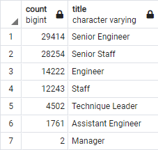
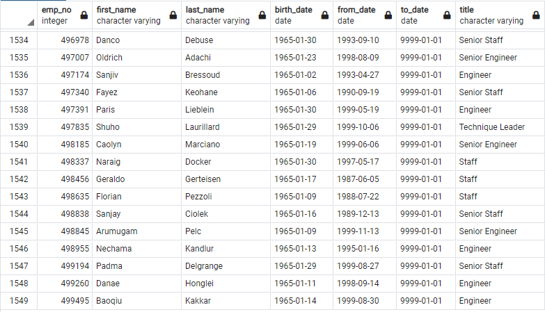

# Pewlett_Hackard_Analysis

## Overview of the Analysis
The purpose of our analysis was to determine the number of employees retiring from Pewlett Hackard per Title and to identify employees who are eligible to participate in a mentorship program.

## Results of the Analysis
* By running a query to determine the number of employees retiring per Title, we determine that the Senior Engineers and Senior Staff are a high number of the employees retiring.

    

* Knowing that these two titles (Senior Engineers and Senior Staff) are your titles with the most to retire, the establishment of a mentoring program will be vital to ensure that the knowledge of those Senior staff will be passed on to those in the organization who will not retire soon.

* There is a total of 1,549 employees eligibile for the mentorship program.
    

* There is a total of 90,398 number of employees retiring from Pewlett Hackard.  With there being 1,549 eligibile for the mentorship program, Pewlett Hackard will have more than enough employees from those who are to retire to be mentors for those eligible for the mentorship program.

## Summary
To make an impact as the "silver tsunami" begins, Pewlett Hackard will need to fill at least 75% of the number of employees retiring from the organization.
Approximately 50% of the employees retiring are in a Senior role.  These are your most qualified employees and therefore would indicate the organization would have enough retirement-ready employees to mentor the next generation.

## Other Areas for Analysis
1. A deeper look into a more specific timeframe for retirement would be helpful.  Take employees who are eligible for retirement and break it down into 3 month periods to determine titles/roles eligible for each quarter.
2. A query into the titles of those employees who are eligible for the mentorship program would be helpful to ensure you would have enough employees to mentor those eligible for each title.
